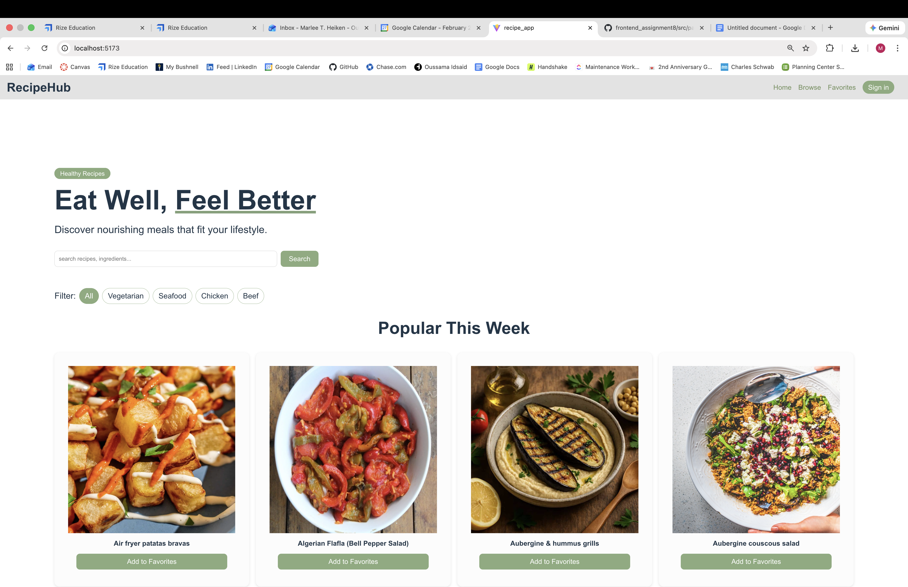
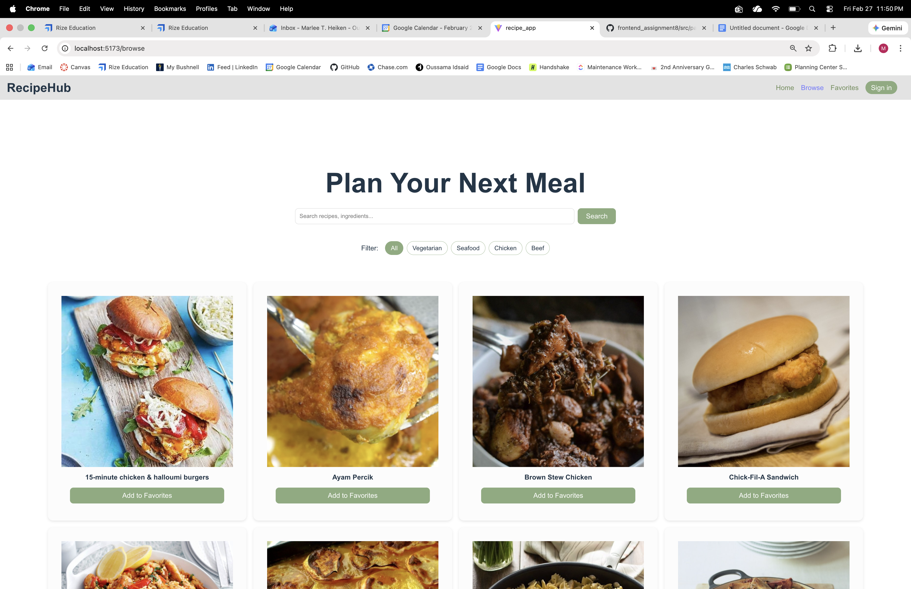
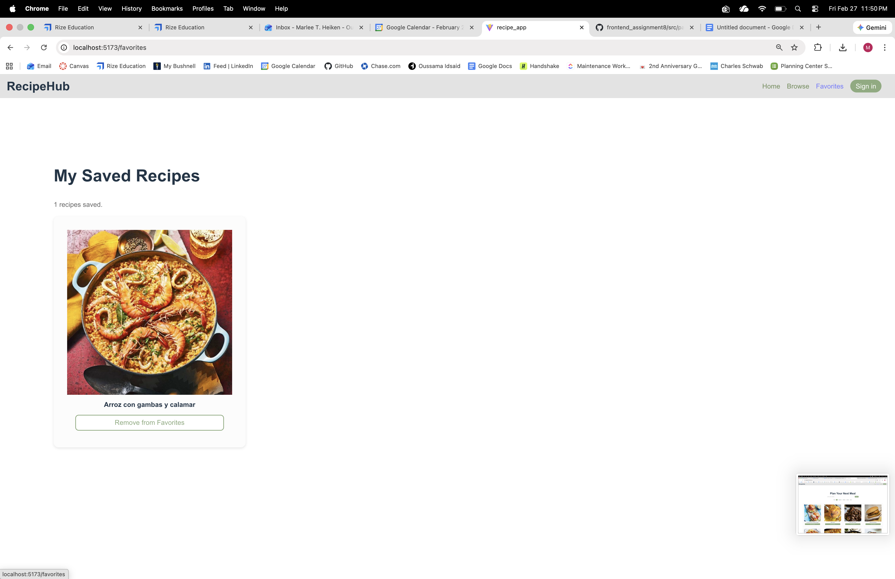
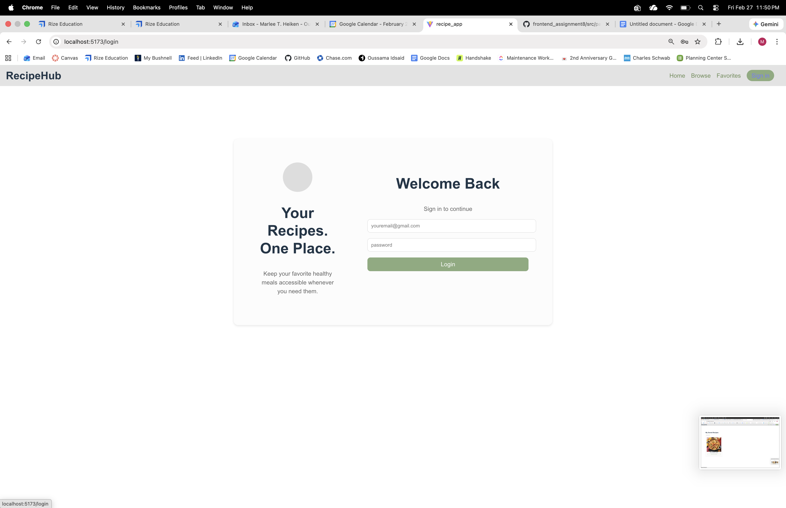

# RecipeHub Frontend

RecipeHub is a React single-page app for discovering meals, viewing recipe details, and saving favorites by account.  
It demonstrates authenticated routing, role-based access control (regular/admin), and client-side security guardrails.

Live deployment: https://frontend-recipe-app-indol.vercel.app/

## Problem Statement

Users need one place to:
- Search and browse healthy meal ideas.
- Save personal favorites.
- Access role-based functionality (admin visibility into all users' saved recipes).

## Core Features

- Home and browse experiences backed by TheMealDB API.
- Recipe detail page with ingredient checklist and save/remove favorite controls.
- Authentication system with:
  - Registration and login forms.
  - Role selection (`regular` or `admin`) at registration.
  - JWT-like session token creation and expiration handling.
  - Logout with session cleanup.
- Protected routes:
  - `/favorites` requires authentication.
  - `/saved` requires admin role.
- Admin dashboard that displays all users' saved recipes.
- Auth feedback states (validation errors, failed auth, account creation success).

## Security Notes

This is a frontend-only project, so security is best-effort and educational:

- XSS mitigation:
  - User-entered auth/search strings are sanitized before use.
  - React escaping is preserved (no `dangerouslySetInnerHTML`).
- CSRF mitigation:
  - A per-session CSRF token is generated in auth context.
  - Auth form submissions include and validate that token.
- Token handling:
  - Session token is stored in `sessionStorage` (not persisted across browser restarts).
  - Token expiration is validated on boot and scheduled for auto-logout.
  - Logout clears token/user session data.

## Tech Stack

- React 19
- Vite 7
- React Router DOM 7
- Vitest + Testing Library + JSDOM
- CSS (custom styles)
- TheMealDB API

## Project Structure

- App source: `recipe_app/src`
- Contexts:
  - `src/contexts/AuthContext.jsx`
  - `src/contexts/FavoritesContext.jsx`
- Security/auth helpers:
  - `src/utils/security.js`
  - `src/utils/authApi.js`
- Routes/pages:
  - `src/pages/*`

## Setup and Installation

1. Clone repository:
   ```bash
   git clone https://github.com/marleeheiken/frontend_recipe_app.git
   cd frontend_recipe_app/recipe_app
   ```
2. Install dependencies:
   ```bash
   npm install
   ```
3. Create `.env` in `recipe_app` root:
   ```env
   VITE_MEALDB_KEY=1
   ```
4. Run locally:
   ```bash
   npm run dev
   ```
5. Build for production:
   ```bash
   npm run build
   ```

## Authentication Documentation

`AuthContext` owns auth state and exposes:

- `register({ email, password, role, csrf })`
- `login({ email, password, role, csrf })`
- `logout()`
- `isAuthenticated`
- `hasRole(role)`
- `csrfToken`

Flow summary:

1. Register stores user credentials in a local mock user store.
2. Login verifies credentials and returns a JWT-like token.
3. Session (`user + token`) is saved to `sessionStorage`.
4. Token expiration is enforced at startup and via logout timer.
5. Protected routes redirect unauthenticated/unauthorized users.

## API Integration Documentation

All API calls are centralized in `src/utils/api.js`:

- `searchMeals(query)`
- `getMealById(id)`
- `filterByCategory(category)`
- `listCategories()`

Base URL uses `VITE_MEALDB_KEY`:

`https://www.themealdb.com/api/json/v1/${VITE_MEALDB_KEY}`

## Testing

Test command:

```bash
npm run test -- --run
```

Coverage includes:

- API utility behavior and endpoint construction.
- Security utility functions.
- Auth service and AuthContext flows.
- Login/register form validation and feedback.
- Protected route access behavior.
- Existing page/component behavior (Home, Header, RecipeDetail).

## Deployment Process and Environment Configuration

This app is deployed via Vercel.

Recommended deployment steps:

1. Push to GitHub.
2. Import repo in Vercel.
3. Set environment variables:
   - `VITE_MEALDB_KEY=1` (or your own key)
4. Trigger build using:
   - Install: `npm install`
   - Build: `npm run build`
5. Verify protected routes and auth flows in deployed app.

## Screenshots

Home  


Browse  


Favorites  


Sign In  


## Known Issues

- Local environment currently uses Node `20.11.0`; Vite recommends `20.19+` or `22.12+`.
- In this environment, Vitest worker startup fails with a dependency ESM/CJS mismatch (`ERR_REQUIRE_ESM` from `html-encoding-sniffer`). Updating Node resolves this.
- Frontend-only auth cannot provide true backend-grade security (no HttpOnly cookies/server-side session revocation).

## Future Enhancements

- Replace mock auth store with real backend auth and refresh-token flow.
- Add server-issued CSRF tokens and HttpOnly cookie strategy.
- Expand automated coverage reporting thresholds in CI.
- Improve responsive spacing and accessibility polish.
